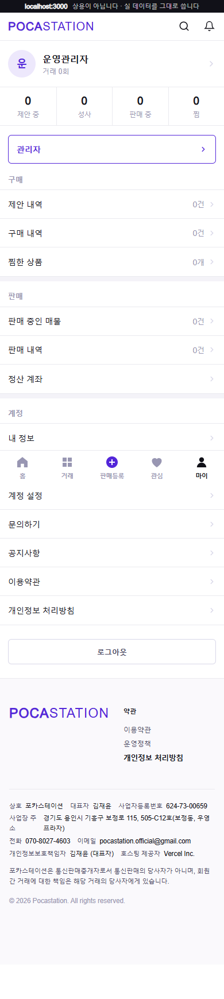
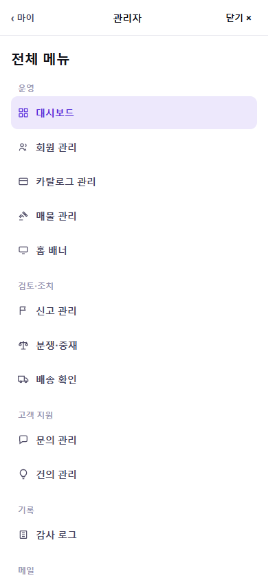
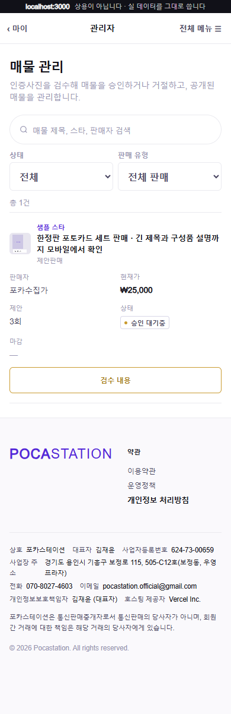
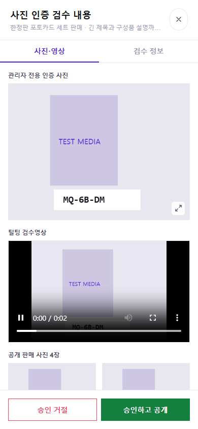
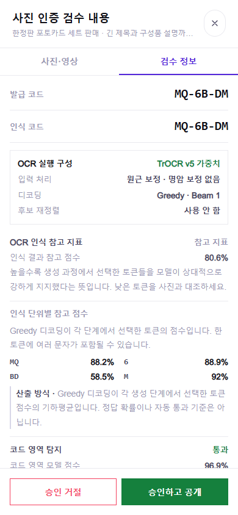
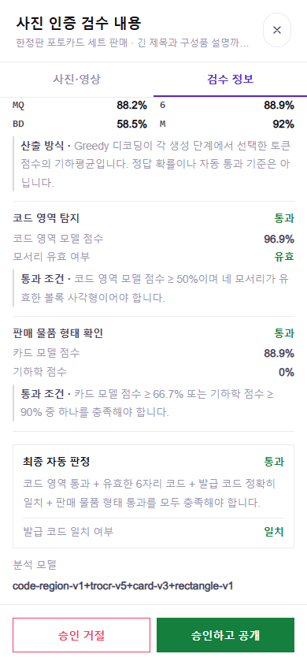
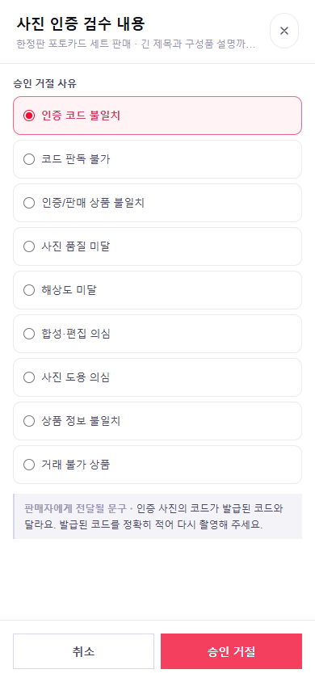
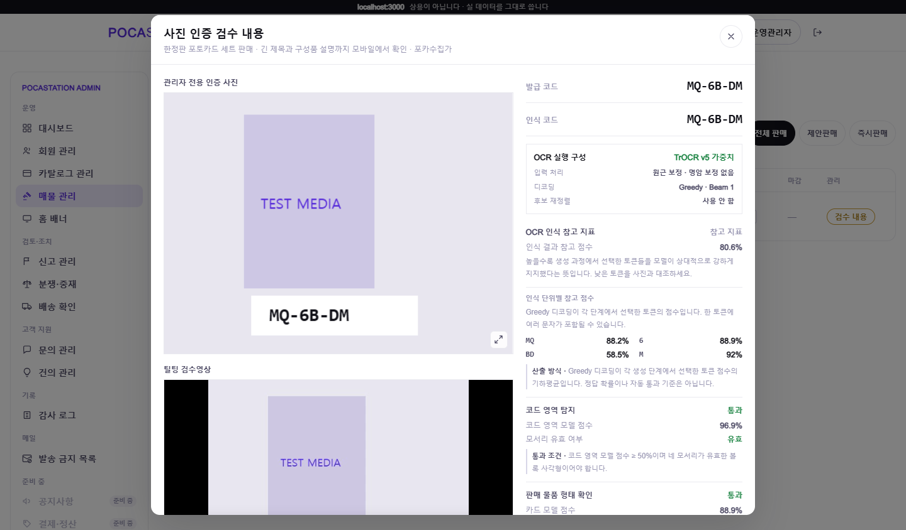
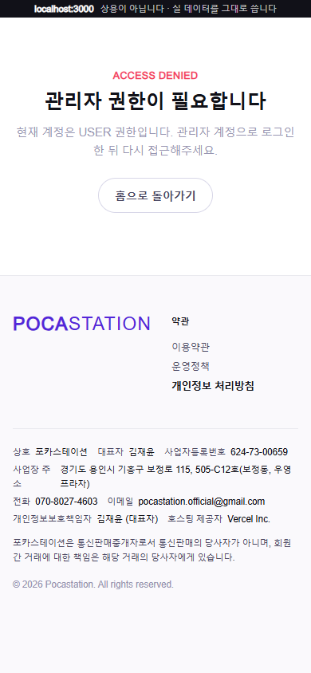

# 모바일 관리자 화면 검증 (#563)

2026-09-05, `develop`의 `90d11e7` 기준. 최신 pull 및 기존 이슈·PR 확인 후 `feature/563`에서 작업.

## 실행 환경

- Next.js 로컬 개발 서버 + Playwright/Chrome headless
- 모바일 화면 폭 320/390/768px, PC 1440px
- 관리자 API 및 로그인 응답은 브라우저 요청 인터셉트로 모의 처리. 운영 데이터 변경 없이 검증
- 사진·영상은 검증용으로 생성한 `TEST MEDIA`. 인증 사진은 Bearer 인증 요청의 Blob 응답, 영상은 FFmpeg로 생성한 WebM을 사용

## 확인 결과

- 관리자 계정(`ADMIN`, `ROLE_ADMIN`)의 모바일 마이 메뉴에서 구매 위에 관리자 진입 버튼 표시
- 일반 회원은 관리자 버튼 미표시. `/admin` 직접 접근 시 권한 안내, 관리자 API 요청 0건
- 비로그인은 `/login?redirect=/admin`으로 이동, 관리자 API 요청 0건
- 전체 메뉴: 활성 12개 및 준비 중 3개 표시. 리뷰 신고 하위 탭을 포함해 관리자 화면 13개 확인
- 모바일 목록의 가로 넘침 없음. 회원·신고·문의·분쟁의 상세 진입과 목록 복귀, 카탈로그 등록·연결·편집 화면 확인
- 인증 사진 확대, Blob 원본 표시, 공개 판매 사진 이동, 확대 뷰어만 Esc로 닫기, 누른 버튼으로 포커스 복귀
- 검수영상의 실제 재생 시간 증가 및 사진 확대 시 일시정지 확인
- 코드, OCR 구성·점수·토큰·설명, 코드 영역·형태 판정 및 조건, 최종 자동 판정, 분석 모델 등 38개 검수 정보 문자열 확인
- 요청한 안내 문장, 사진 번호 캡션, 앞면·뒷면 문구 미표시
- 9개 거절 사유와 판매자 전달 문구, 미선택 검증, 기존 `PATCH /reject`의 `reasonCode` 유지
- 기존 `PATCH /approve`, 요청 오류 안내와 재시도, 읽기 전용, 미디어 없음·분석 대기·자료 조회 실패 화면 확인
- 모바일 검수 버튼의 화면 하단 고정 확인
- 타입 검사와 변경한 관리자·공용 컴포넌트 린트 통과. 마이페이지 전체 린트에는 기존 미사용 import 경고 1건 존재
- `next build --webpack` 통과. API 빌드 설정은 로컬 테스트 주소 사용

서버의 `/api/admin/**`에 대한 `hasRole("ADMIN")` 설정도 소스에서 확인. 이번 변경은 기존 인증·인가 및 API 계약 유지.

## 화면 증거

### 마이 메뉴와 전체 메뉴

### 매물 목록과 검수 자료

### 검수 정보와 거절 사유

### PC 검수와 접근 권한

