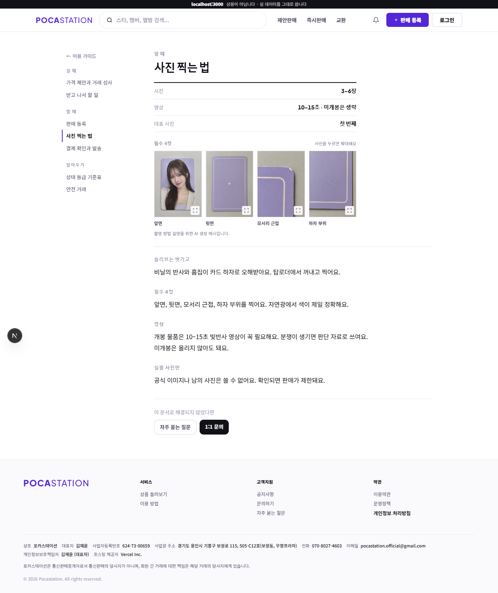
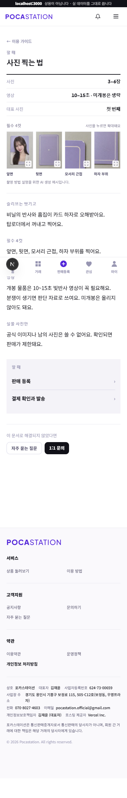
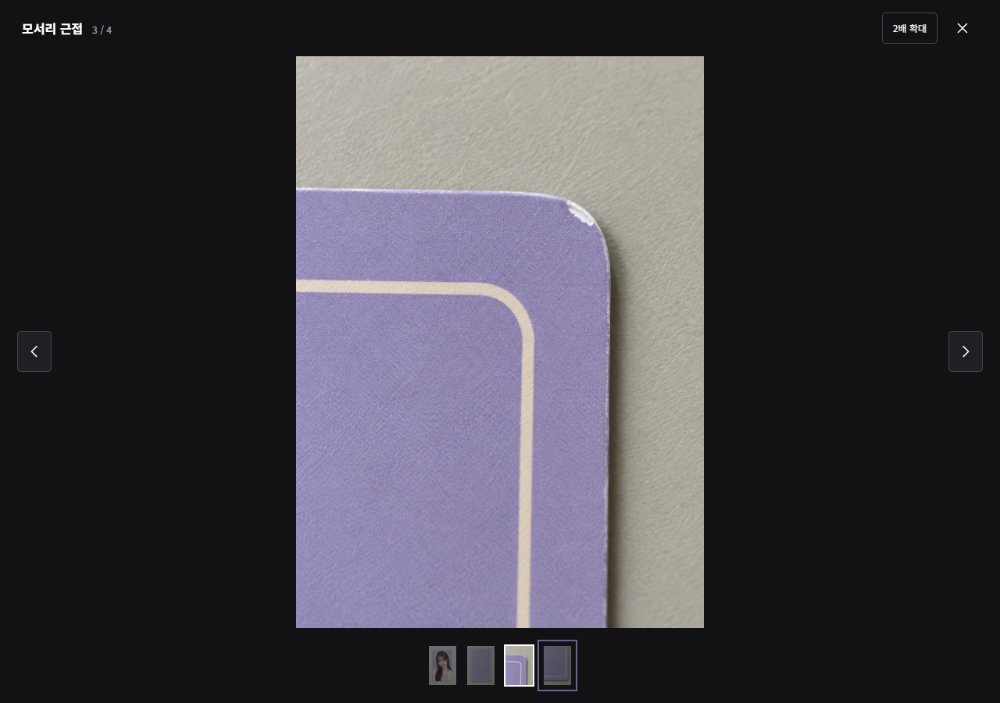

# 사진 촬영 가이드 검증 (#749)

2026-09-23, 구현 커밋 `5b0543a` 기준 로컬 Next.js 개발 서버와 Playwright/Chrome에서 확인.

## 검증 환경과 결과

- 비로그인 API 응답을 모의 처리한 `/guide/photo` 화면. 운영 API 변경 없음.
- PC 1280×900, 모바일 화면 폭 320px·390px에서 필수 4컷과 확대 컨트롤 배치 확인.
- 네 사진의 원본 열기, 2배 확대와 드래그, 이전·다음 순환, 썸네일 선택, 방향키·Esc, 포커스 순환과 닫은 뒤 복귀 확인.
- 모바일 폭에서 가로 넘침 없음. 스와이프는 데스크톱 브라우저의 포인터 입력으로 검증했으며 실제 모바일 기기 검증은 미실시.
- 다른 가이드(`/guide/sell`)에 사진 예시가 표시되지 않는 것 확인.
- `tests/browser/guide-photo.spec.ts` 4개 테스트, 변경 파일 ESLint, TypeScript 검사, `next build --webpack` 통과.

## 화면 증거

### PC 가이드

### 모바일 가이드

### 확대 보기

